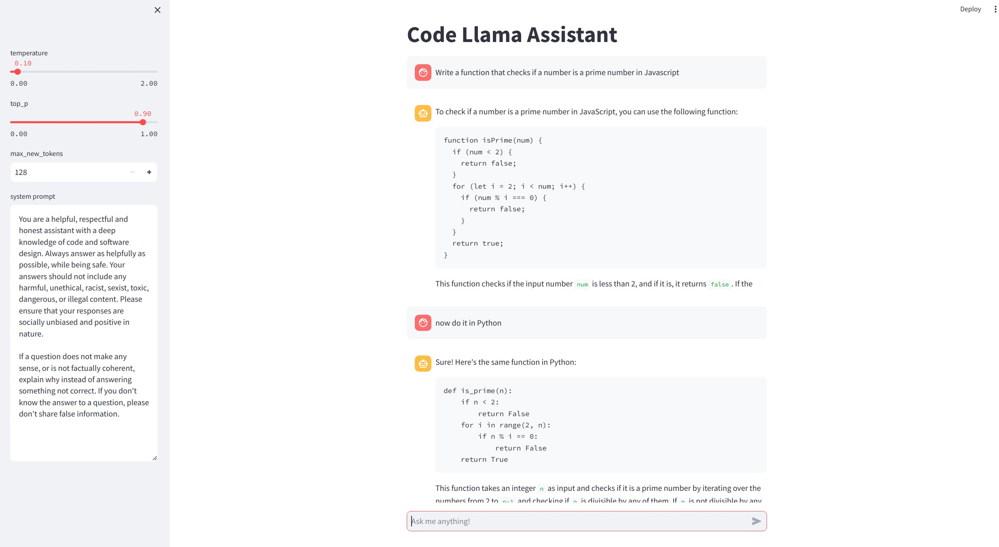

# codellama-chatbot
A local LLM chatbot using [CodeLlama-7b-Instruct-hf](https://huggingface.co/codellama/CodeLlama-7b-Instruct-hf)

# Dependencies
- torch
- transformers
- bitsandbytes
- accelerate
- streamlit

# Running the chatbot
`streamlit run app.py`
